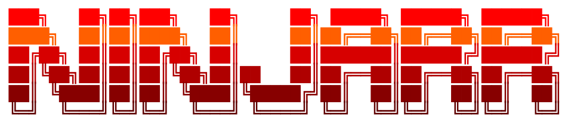
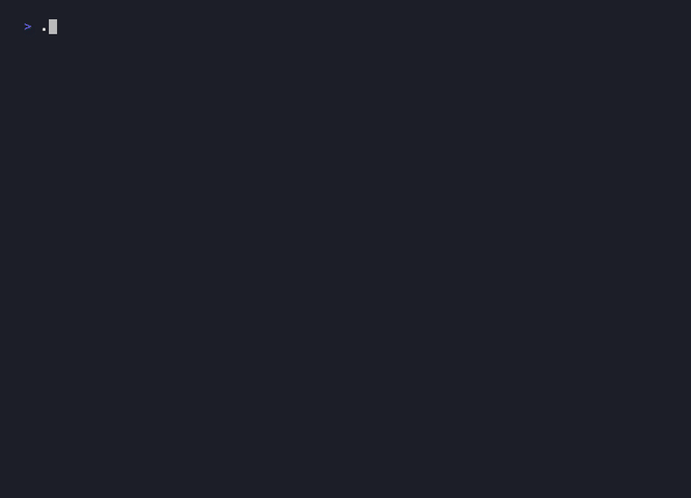
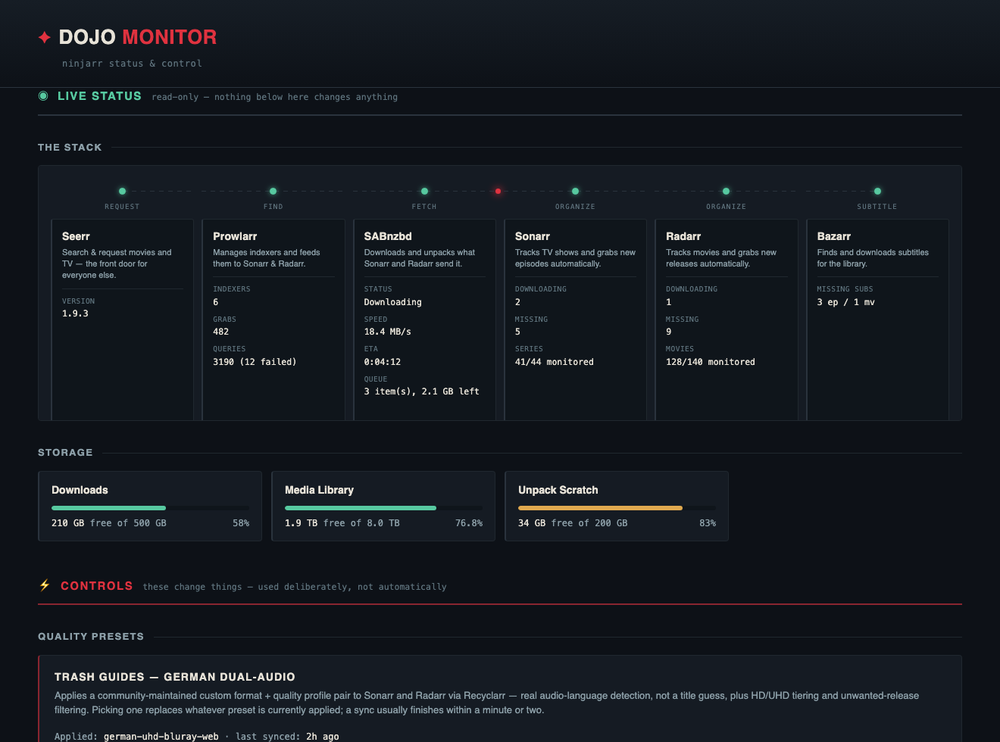

<div align="center">



**A Usenet media stack that wires itself, pre-tuned for German dual-audio releases.**

[](LICENSE)
[](bootstrap.sh)
[](compose/core.yml)

</div>

---

## What this is

A Usenet stack (search, download, organize, subtitle) normally means six separate apps and thirty clicks of pasting API keys between them before anything works. `bootstrap.sh` does that wiring itself, over each app's own API, and pre-tunes Sonarr and Radarr for German dual-audio releases while it's at it. Point it at a box, answer a few questions, done.

## Before you start

ninjarr wires these together. It doesn't provide them. Get these three sorted first:

- **A Usenet provider.** Paid access to a newsgroup server: this is what actually holds and serves the files, like a specialized ISP. Not a torrent tracker, not free.
- **An NZB indexer.** A search engine over Usenet, so Prowlarr has something to search. Usually a separate signup from your provider.
- **A media server, already installed.** [Plex](https://www.plex.tv/), [Jellyfin](https://jellyfin.org/), or [Emby](https://emby.media/): ninjarr organizes and subtitles your library, it doesn't stream it. Point Seerr at whichever one you run during its setup wizard.

New to Usenet entirely? [r/usenet's wiki](https://www.reddit.com/r/usenet/wiki/index) is a plain, vendor-neutral rundown of both providers and indexers.

## Run it

```bash
git clone https://github.com/DBCooperX/ninjarr.git
cd ninjarr
./bootstrap.sh
```

What you'll see:

<p align="center"></p>

## The flow

A request moves through the stack in one direction:

**Seerr** *(you ask)* → **Prowlarr** *(finds it on your indexers)* → **SABnzbd** *(downloads it)* → **Sonarr / Radarr** *(imports and organizes it)* → **Bazarr** *(grabs subtitles)* → your media server *(Plex, Jellyfin, Emby, bring your own)*.

Dojo Monitor lays this out live, with real stats at each stage. See below.

## What you get

| Service | Port | Job |
|---|---|---|
| **Seerr** | 5055 | Request portal for Plex, Jellyfin or Emby |
| **Sonarr** | 8989 | TV |
| **Radarr** | 7878 | Movies |
| **Prowlarr** | 9696 | Indexer manager, syncs to both arrs |
| **SABnzbd** | 8080 | Usenet downloader |
| **Bazarr** | 6767 | Subtitles |
| **Recyclarr** | n/a | Syncs quality tuning into both arrs; no UI |
| **Dojo Monitor** | 1337 | Live dashboard + a few safe controls |

Wired automatically: download clients, categories, root folders, Prowlarr→arr links, Bazarr's connection to both arrs, German dual-audio tuning (see below), and a handful of settings that are correct regardless of your environment: SABnzbd's Direct Unpack off, hardlinks and rename on in both arrs, Download Only Monitored in Bazarr.

Still yours: your Usenet provider, your indexer (unless it's a plain Newznab site, which Dojo can add), the Seerr wizard, and a subtitle provider in Bazarr (Settings → Subtitles Providers, e.g. OpenSubtitles.com). Without one, Bazarr has nowhere to actually search.

## German dual-audio tuning

Sonarr and Radarr get their custom formats and quality profile from [Recyclarr](https://github.com/recyclarr/recyclarr) syncing [TRaSH Guides](https://github.com/TRaSH-Guides/Guides)' own German dual-audio presets: real audio-language detection, HD/UHD tiering, kept current by the community rather than a one-off regex. `bootstrap.sh` applies the UHD tier by default; switch tiers any time from Dojo. Bazarr gets a matching languages profile (German first, English fallback) from `config/languages-profiles/`. Once a sync lands, Dojo prunes Sonarr/Radarr down to exactly one quality profile: the one the currently applied preset creates. That covers Sonarr/Radarr's stock defaults (Any, SD, HD-720p, and so on) and, on a tier switch, whatever the previously applied preset left behind. Recyclarr itself never cleans up an old profile once you've moved to a different one.

Don't want German tuning? Delete that file and pick a different preset in Dojo. The rest of ninjarr doesn't care; it's just a stack-wiring tool at that point.

## Dojo Monitor

`http://<host>:1337`, built and run locally, no upstream image. This is where you actually spend time day to day, split into two clearly marked zones so it's obvious what's safe to click and what isn't.

<p align="center"></p>

**Live status** (read-only):
- **The stack**, laid out as the flow above, with live per-app stats (SAB speed/ETA/queue, Sonarr/Radarr queue/missing/monitored, Prowlarr grabs and query health, Bazarr missing subtitles), refreshed every 15s.
- **Storage**: free space on downloads, media, and the unpack scratch disk, color-coded, refreshed every 30s. If media's on a NAS, a small badge shows up next to it. Click it for setup notes.
- **Health**: every app's own self-diagnosed problems (indexer down, no download client, missing languages profile, and more) in one list, pulled straight from Sonarr/Radarr/Prowlarr/Bazarr/SABnzbd's own health checks. Fully hidden the moment nothing's wrong.

**Controls** (things that actually change something):
- **Presets**: switch Recyclarr's German dual-audio tier, or re-sync the current one, without re-running bootstrap.
- **Downloads**: pause or resume SABnzbd's whole queue.
- **Search for missing**: trigger Sonarr's or Radarr's own missing-item search on demand.
- **Add an indexer**: Generic Newznab, straight into Prowlarr, synced to both arrs. Grabs redirect straight to the indexer, so SABnzbd is always what actually fetches the NZB. Some indexers ban on sight if grabs come from anything else.
- **Notifications (optional)**: one Discord webhook URL, wired into Sonarr and Radarr for grabs, imports, and health issues. Skip it if you don't want it.

That's the extent of it by design: no general settings editing, no Docker socket access. Everything else stays in each app's own UI.

## Requirements

- Linux with Docker and Compose v2
- `curl` and `jq`
- Somewhere to put media

## Setup notes

**Storage is split in two.** `DOWNLOADS` is scratch, where completed downloads land before the arrs import them. `MEDIA` is your actual library, what Plex/Emby/Jellyfin reads. Same box, same filesystem by default; `MEDIA` can also point at an already-mounted NAS share (bootstrap doesn't mount NAS shares for you, so mount it yourself first, then point `MEDIA` at it). `INCOMPLETE`, the unpack scratch disk, should always stay local and fast, never a network share.

**Ownership.** `bootstrap.sh` auto-detects `PUID`/`PGID` from your media directory's real owner if it exists, your own account otherwise, or `1000:1000` as a last resort. Re-checked and offered as a fix every run if it ever drifts. Seerr and Recyclarr always run as uid `1000` internally regardless of what you set.

**If `MEDIA` is on a NAS**, a few things to get right:
- **UID/GID must match** what owns the files on the NAS side, or Sonarr/Radarr can't write there. A Synology mapping all users to admin typically hands out `1024:100`, not `1000:1000`. Check with `stat -c '%u:%g'` on the mounted share.
- **Hardlinks need one filesystem.** `DOWNLOADS` and `MEDIA` on different filesystems means imports copy instead of hardlink: slower, uses more disk, but not broken.
- **NFS has no inotify.** Add a Connect entry in Sonarr and Radarr pointing at your media server, or new files never show up there on their own.
- **NFS version matters.** Older/consumer NAS units often lack NFSv4.1. Files owned by `65534`/`nobody` means force NFSv3 in your mount options.

`bootstrap.sh` checks all of this automatically (ownership, filesystem match, NFS) and Dojo's Storage panel surfaces it live via a small badge next to your media volume, so this stays out of the way entirely if your media's just local.

**Recyclarr presets don't apply instantly.** Its container polls for a trigger file every few seconds rather than being called directly; give it a minute or two. Dojo's Presets panel shows the last-synced time. It also re-syncs weekly on its own, so upstream TRaSH updates land automatically.

## Layout

```
bootstrap.sh                detect → compose up → wire over the APIs
compose/core.yml            the eight services
dojo/                       Dojo Monitor, built locally
dojo/recyclarr-templates/   TRaSH Guides' German presets, bundled
recyclarr/                  the recyclarr wrapper image, built locally
config/languages-profiles/  optional bazarr.json, Bazarr's default languages profile
.env.example                copy to .env, or let bootstrap ask you
docs/                       README's banner/demo.gif/dojo.png, and demo.gif's VHS source
```

## Running it again

It's idempotent: everything checks for existing config before creating it, so re-running after changing a path or switching presets is safe.

## Credit

This is just the glue. All of it is other people's excellent work. Go support them:

- [Sonarr](https://github.com/Sonarr/Sonarr) & [Radarr](https://github.com/Radarr/Radarr): TV and movie automation
- [Prowlarr](https://github.com/Prowlarr/Prowlarr): indexer manager
- [SABnzbd](https://github.com/sabnzbd/sabnzbd): Usenet downloader
- [Bazarr](https://github.com/morpheus65535/bazarr): subtitles
- [Seerr](https://github.com/seerr-team/seerr): the request portal
- [Recyclarr](https://github.com/recyclarr/recyclarr) and the [TRaSH Guides](https://github.com/TRaSH-Guides/Guides) community that maintains the presets it applies
- [LinuxServer.io](https://www.linuxserver.io/), whose container images this stack runs on

## License

MIT, see [LICENSE](LICENSE).
